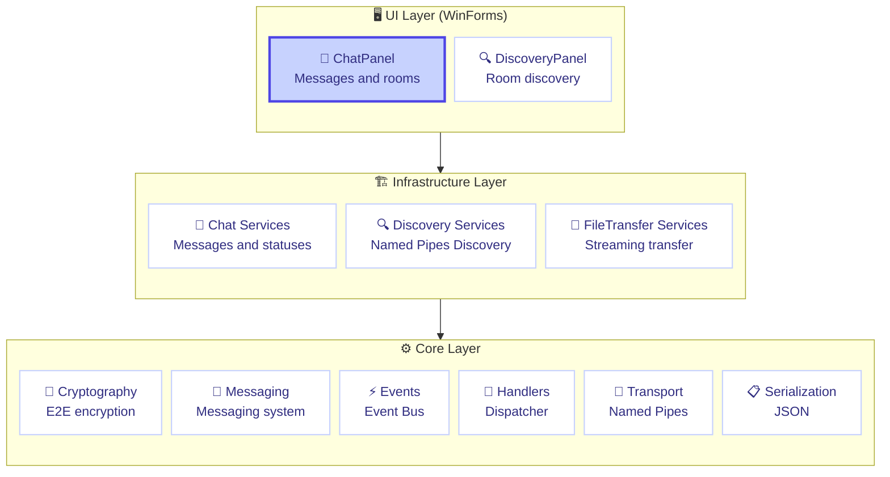
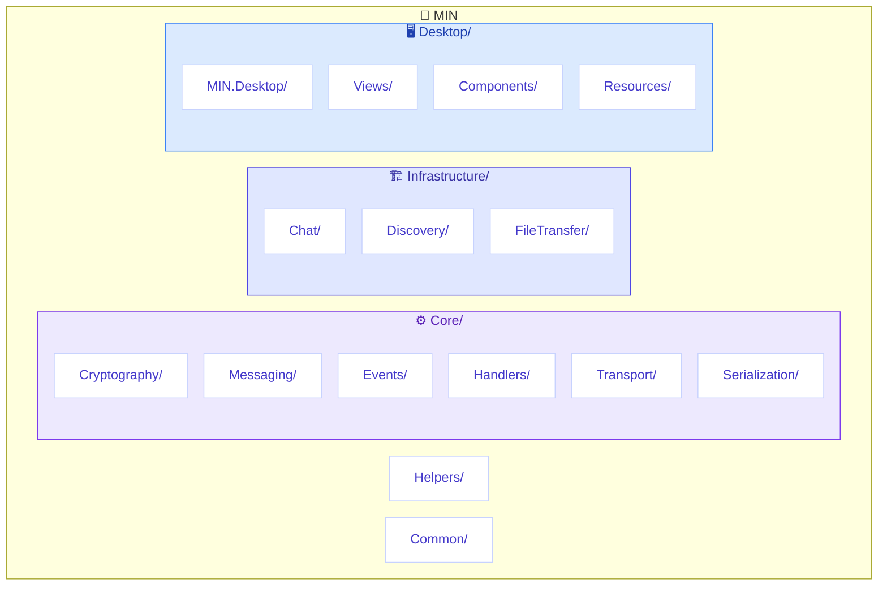
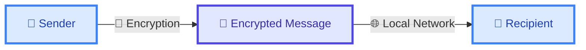

# MIN - Local Messenger


> **Secure local messenger with end-to-end encryption for local network**

[](https://github.com/CasCadeVR/MIN/stargazers)
[](https://github.com/CasCadeVR/MIN/network/members)
[](https://github.com/CasCadeVR/MIN/blob/main/LICENSE)
[](https://dotnet.microsoft.com/)
[](https://docs.microsoft.com/en-us/dotnet/csharp/)

[English](README.md) • [Русский](README.ru.md)

---

## 📑 Contents

- [🎯 Features](#-features)
- [🏗️ Architecture](#-architecture)
- [🛠️ Technology Stack](#-technology-stack)
- [🚀 Installation and Running](#-installation-and-running)
- [📁 Project Structure](#-project-structure)
- [🔐 Security](#-security)
- [📸 Interface](#-interface)
- [🤝 Authors](#-authors)

---

## 🎯 Features

| Feature | Description |
|---------|-------------|
| 🔒 **End-to-End Encryption** | All messages are encrypted using cryptography |
| 📁 **File Transfer** | Sending and receiving photos and files |
| 🌐 **Local Discovery** | Automatic room discovery via Named Pipes |
| 💬 **Text Messages** | Sending and receiving messages in real time |
| 👥 **Rooms** | Creating and joining chat rooms |
| 🖥️ **Desktop UI** | Intuitive interface using WinForms |

> [!IMPORTANT]
> MIN works **without a server** in your local network. No internet connection required!

---

## 🏗️ Architecture



### Modules

#### Core
| Module | Purpose |
|--------|---------|
| `MIN.Core.Cryptography` | Cryptographic operations |
| `MIN.Core.Messaging` | Messaging system |
| `MIN.Core.Events` | Event Bus |
| `MIN.Core.Handlers` | Handlers with dispatcher |
| `MIN.Core.Transport` | Named Pipes transport |
| `MIN.Core.Serialization` | JSON serialization |
| `MIN.Core.Entities` | Data models |
| `MIN.Core.Stores` | Stores |
| `MIN.Core.Streaming` | Data streams |

#### Infrastructure (Business Logic)
| Module | Purpose |
|--------|---------|
| `MIN.Chat` | Chats and messages |
| `MIN.Discovery` | Room discovery |
| `MIN.FileTransfer` | File transfer |

#### Desktop (UI)
| Module | Purpose |
|--------|---------|
| `MIN.Desktop` | WinForms application |

---

## 🛠️ Technology Stack

| Category | Technology | Description |
|----------|------------|-------------|
| 🔷 Language | C# | Modern object-oriented language |
| ⚙️ Platform | .NET 8.0 | Cross-platform framework |
| 🖼️ UI | WinForms | Windows desktop interface |
| 📦 DI | Microsoft.Extensions.DependencyInjection | Dependency injection |
| 🔐 Security | System.Security.Cryptography.ProtectedData | Windows DPAPI |
| 🔌 Transport | Named Pipes | Inter-process communication |
| 📋 Style | .editorconfig | Unified code style |

---

## 🚀 Installation and Running

### Requirements

> [!TIP]
> Make sure you have .NET SDK 8.0 or higher installed.

- [.NET SDK 8.0](https://dotnet.microsoft.com/download/dotnet/8.0) or higher
- Windows 10/11
- Local network (for room discovery)

### Quick Start

```bash
# 1. Clone the repository
git clone https://github.com/CasCadeVR/MIN.git
cd MIN

# 2. Restore dependencies
dotnet restore

# 3. Build the project
dotnet build

# 4. Run the application
dotnet run --project Desktop/MIN.Desktop/MIN.Desktop.csproj
```

---

## 📁 Project Structure



> [!NOTE]
> Configuration files (`Directory.Build.props`, `Directory.Packages.props`) manage dependencies centrally.

---

## 🔐 Security

> [!IMPORTANT]
> MIN uses **end-to-end encryption** — your messages are protected from interception.

### Encryption Scheme



### Security Technologies

| Technology | Purpose |
|------------|---------|
| 🔑 **Asymmetric (RSA)** | Key exchange between participants |
| 🛡️ **Symmetric (AES)** | Message content encryption |
| 💾 **Windows DPAPI** | Secure key storage |

---

## 📸 Interface

MIN provides a modern interface for:

| Function | Description |
|----------|-------------|
| 🏠 **Rooms** | Creating and managing chat rooms |
| 💬 **Chat** | Real-time communication |
| 📁 **Files** | Transfer with progress display |
| 👥 **Participants** | Online/offline statuses |

> [!NOTE]
> 📸 Screenshots will be added after the first release.

---

## 🤝 Authors

| Author | Role | Contribution |
|--------|------|--------------|
| 👨‍💻 [**CasCadeVR**](https://github.com/CasCadeVR) | Founder | Lead developer, architecture creator |
| 💡 [**Karo4a**](https://github.com/Karo4a) | Inspiration | Ideas and inspiration |

---

> [!TIP]
> **Made with ❤️ by CasCade team**

*MIN — Local messenger for your network*

---

[](https://github.com/CasCadeVR/MIN)
[](https://github.com/CasCadeVR/MIN)

[Source Code](https://github.com/CasCadeVR/MIN) • 
[Report an Issue](https://github.com/CasCadeVR/MIN/issues) • 
[MIT License](LICENSE)