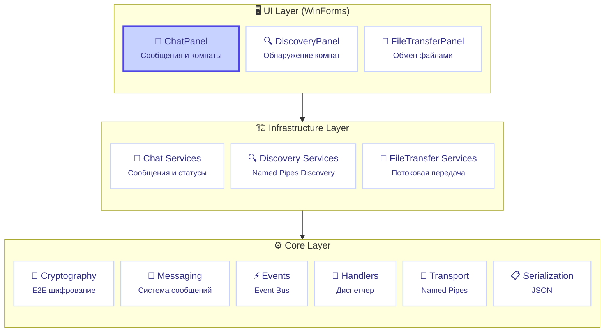
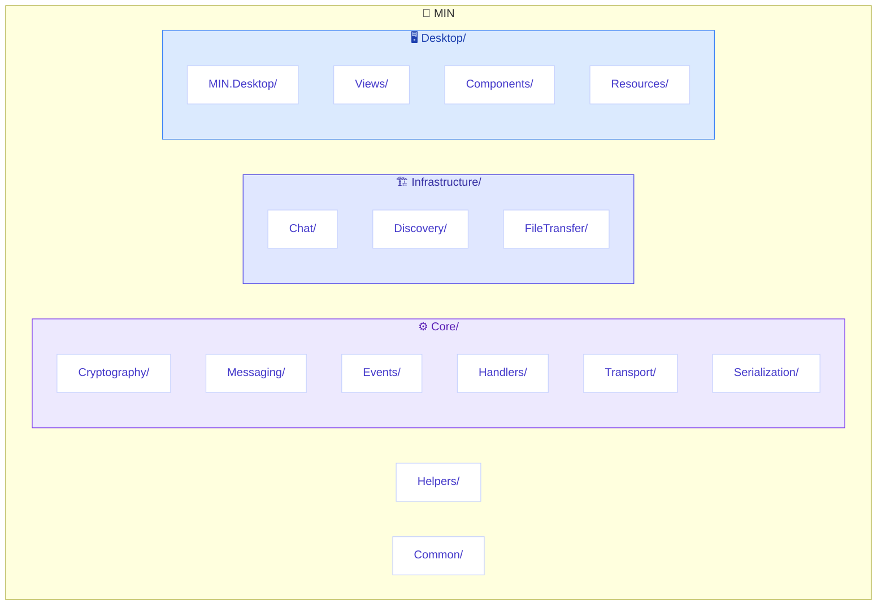
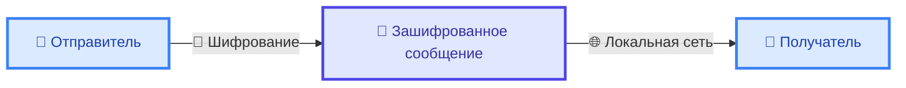

# MIN - Local Messenger


> **Безопасный локальный мессенджер с end-to-end шифрованием для локальной сети**

[](https://github.com/CasCadeVR/MIN/stargazers)
[](https://github.com/CasCadeVR/MIN/network/members)
[](https://github.com/CasCadeVR/MIN/blob/main/LICENSE)
[](https://dotnet.microsoft.com/)
[](https://docs.microsoft.com/en-us/dotnet/csharp/)

---

## 📑 Содержание

- [🎯 Возможности](#-возможности)
- [🏗️ Архитектура](#-архитектура)
- [🛠️ Технологический стек](#-технологический-стек)
- [🚀 Установка и запуск](#-установка-и-запуск)
- [📁 Структура проекта](#-структура-проекта)
- [🔐 Безопасность](#-безопасность)
- [📸 Интерфейс](#-интерфейс)
- [🤝 Авторы](#-авторы)

---

## 🎯 Возможности

| Возможность | Описание |
|-------------|----------|
| 🔒 **End-to-End шифрование** | Все сообщения шифруются с использованием криптографии |
| 📁 **Передача файлов** | Отправка и получение фотографий и файлов |
| 🌐 **Локальное обнаружение** | Автоматическое обнаружение комнат через Named Pipes |
| 💬 **Текстовые сообщения** | Отправка и получение сообщений в реальном времени |
| 👥 **Комнаты** | Создание и присоединение к чат-комнатам |
| 🖥️ **Desktop UI** | Интуитивный интерфейс на WinForms |

> [!IMPORTANT]
> MIN работает **без сервера** в вашей локальной сети. Не требуется подключение к интернету!

---

## 🏗️ Архитектура



### Модули

#### Core (Ядро)
| Модуль | Назначение |
|--------|------------|
| `MIN.Core.Cryptography` | Криптографические операции |
| `MIN.Core.Messaging` | Система сообщений |
| `MIN.Core.Events` | Event Bus |
| `MIN.Core.Handlers` | Обработчики с dispatcher |
| `MIN.Core.Transport` | Транспорт Named Pipes |
| `MIN.Core.Serialization` | JSON сериализация |
| `MIN.Core.Entities` | Модели данных |
| `MIN.Core.Stores` | Хранилища |
| `MIN.Core.Streaming` | Потоки данных |

#### Infrastructure (Бизнес-логика)
| Модуль | Назначение |
|--------|------------|
| `MIN.Chat` | Чаты и сообщения |
| `MIN.Discovery` | Обнаружение комнат |
| `MIN.FileTransfer` | Передача файлов |

#### Desktop (UI)
| Модуль | Назначение |
|--------|------------|
| `MIN.Desktop` | WinForms приложение |

---

## 🛠️ Технологический стек

| Категория | Технология | Описание |
|-----------|------------|----------|
| 🔷 Язык | C# | Современный объектно-ориентированный язык |
| ⚙️ Платформа | .NET 8.0 | Кроссплатформенный фреймворк |
| 🖼️ UI | WinForms | Настольный интерфейс Windows |
| 📦 DI | Microsoft.Extensions.DependencyInjection | Внедрение зависимостей |
| 🔐 Защита | System.Security.Cryptography.ProtectedData | Windows DPAPI |
| 🔌 Транспорт | Named Pipes | Межпроцессное взаимодействие |
| 🧪 Тестирование | xUnit, FluentAssertions, Moq | Модульные тесты |
| 📋 Стиль | .editorconfig | Единый код-стайл |

---

## 🚀 Установка и запуск

### Требования

> [!TIP]
> Убедитесь, что у вас установлен .NET SDK 8.0 или выше.

- [.NET SDK 8.0](https://dotnet.microsoft.com/download/dotnet/8.0) или выше
- Windows 10/11
- Локальная сеть (для обнаружения комнат)

### Быстрый старт

```bash
# 1. Клонирование репозитория
git clone https://github.com/CasCadeVR/MIN.git
cd MIN

# 2. Восстановление зависимостей
dotnet restore

# 3. Сборка проекта
dotnet build

# 4. Запуск приложения
dotnet run --project Desktop/MIN.Desktop/MIN.Desktop.csproj
```

### Запуск тестов

```bash
dotnet test
```

---

## 📁 Структура проекта



> [!NOTE]
> Конфигурационные файлы (`Directory.Build.props`, `Directory.Packages.props`) управляют зависимостями централизованно.

---

## 🔐 Безопасность

> [!IMPORTANT]
> MIN использует **end-to-end шифрование** — ваши сообщения защищены от перехвата.

### Схема шифрования



### Технологии защиты

| Технология | Назначение |
|------------|------------|
| 🔑 **Асимметричное (RSA)** | Обмен ключами между участниками |
| 🛡️ **Симметричное (AES)** | Шифрование содержимого сообщений |
| 💾 **Windows DPAPI** | Защищённое хранение ключей |

---

## 📸 Интерфейс

MIN предоставляет современный интерфейс для:

| Функция | Описание |
|---------|----------|
| 🏠 **Комнаты** | Создание и управление чат-комнатами |
| 💬 **Чат** | Общение в реальном времени |
| 📁 **Файлы** | Передача с отображением прогресса |
| 👥 **Участники** | Статусы онлайн/оффлайн |

> [!NOTE]
> 📸 Скриншоты будут добавлены после первого релиза.

---

## 🤝 Авторы

| Автор | Роль | Вклад |
|-------|------|-------|
| 👨‍💻 [**CasCadeVR**](https://github.com/CasCadeVR) | Основатель | Основной разработчик, создатель архитектуры |
| 💡 [**Karo4a**](https://github.com/Karo4a) | Вдохновитель | Идеи и вдохновение |

---

> [!TIP]
> **Сделано с ❤️ командой CasCade**

*MIN — Локальный мессенджер для вашей сети*

---

[](https://github.com/CasCadeVR/MIN)
[](https://github.com/CasCadeVR/MIN)

[Исходный код](https://github.com/CasCadeVR/MIN) • 
[Сообщить об ошибке](https://github.com/CasCadeVR/MIN/issues) • 
[Лицензия MIT](LICENSE)