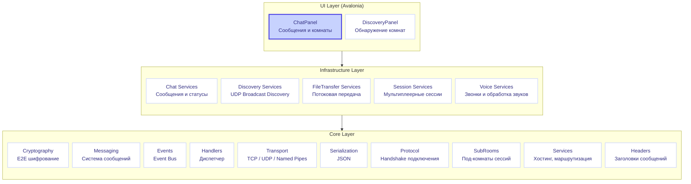
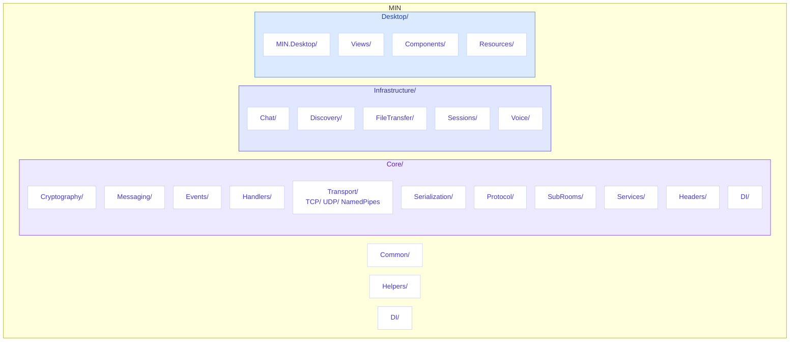
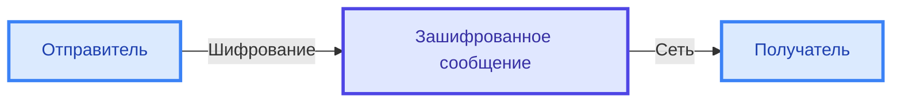
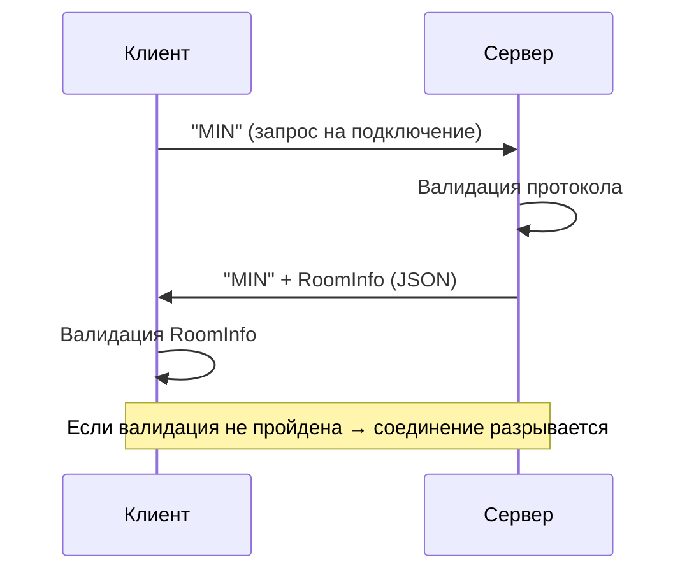
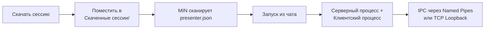

# MIN - Распределённый мессенджер


> **Безопасный распределённый мессенджер с end-to-end шифрованием**

[](https://github.com/MIN-Corp/MIN/stargazers)
[](https://github.com/MIN-Corp/MIN/network/members)
[](https://github.com/MIN-Corp/MIN/blob/main/LICENSE)
[](https://dotnet.microsoft.com/)
[](https://docs.microsoft.com/en-us/dotnet/csharp/)

[English](README.md) • [Русский](README.ru.md)

---

## Содержание

- [Возможности](#-возможности)
- [Архитектура](#-архитектура)
- [Технологический стек](#-технологический-стек)
- [Установка и запуск](#-установка-и-запуск)
- [Структура проекта](#-структура-проекта)
- [Безопасность](#-безопасность)
- [Протокол подключения](#-протокол-подключения)
- [Мультиплеерные сессии](#-мультиплеерные-сессии)
- [Проброс портов](#-проброс-портов)
- [Прямое подключение](#-прямое-подключение)
- [Интерфейс](#-интерфейс)
- [Авторы](#-авторы)

---

## Возможности

| Возможность | Описание |
|-------------|----------|
| **End-to-End шифрование** | Все сообщения шифруются с использованием криптографии |
| **Передача файлов** | Отправка и получение фотографий и файлов |
| **Локальное обнаружение** | Автоматическое обнаружение комнат через UDP Broadcast |
| **Прямое подключение** | Подключение к комнате напрямую по IP:Port |
| **Проброс портов** | UPnP проброс портов для подключений не из LAN |
| **Протокол подключения** | Защищённый handshake протокол перед входом в комнату |
| **Текстовые сообщения** | Отправка и получение сообщений в реальном времени |
| **Комнаты** | Создание и присоединение к чат-комнатам |
| **Мультиплеерные сессии** | Скачивание и запуск игровых сессий из других ресурсов |
| **Звонки** | Конференции по звонку со всеми участниками комнаты |
| **Desktop UI** | Интуитивный интерфейс на Avalonia |

---

## Интерфейс

MIN предоставляет современный интерфейс для:

| Функция | Описание |
|---------|----------|
| **Комнаты** | Создание и управление чат-комнатами |
| **Чат** | Общение в реальном времени |
| **Файлы** | Передача с отображением прогресса |
| **Звонки** | Разговаривайте со своими друзьями по звонку |
| **Участники** | Статусы онлайн/оффлайн |


---

## Архитектура



### Модули

#### Core (Ядро)
| Модуль | Назначение |
|--------|------------|
| `MIN.Core.Cryptography` | Криптографические операции |
| `MIN.Core.Messaging` | Система сообщений |
| `MIN.Core.Events` | Event Bus |
| `MIN.Core.Handlers` | Обработчики с dispatcher |
| `MIN.Core.Transport` | Транспорт TCP / UDP / Named Pipes |
| `MIN.Core.Protocol` | Протокол подключения MIN (handshake) |
| `MIN.Core.SubRooms` | Управление под-комнатами для сессий |
| `MIN.Core.Identity` | Идентификация локального пользователя |
| `MIN.Core.Services` | Хостинг комнат, подключение, маршрутизация |
| `MIN.Core.Headers` | Заголовки сообщений |
| `MIN.Core.Serialization` | JSON сериализация |
| `MIN.Core.Entities` | Модели данных |
| `MIN.Core.Stores` | Хранилища |
| `MIN.Core.Streaming` | Потоки данных |

#### Infrastructure (Бизнес-логика)
| Модуль | Назначение |
|--------|------------|
| `MIN.Chat` | Чаты и сообщения |
| `MIN.Discovery` | Обнаружение комнат через UDP Broadcast |
| `MIN.FileTransfer` | Передача файлов |
| `MIN.Sessions` | Управление мультиплеерными сессиями |
| `MIN.Voice` | Звонки |

#### Desktop (UI)
| Модуль | Назначение |
|--------|------------|
| `MIN.Desktop` | Avalonia десктопное приложение |

#### Cross-Cutting (Сквозные)
| Модуль | Назначение |
|--------|------------|
| `MIN.Common` | Общие интерфейсы, MVC модульная система |
| `MIN.Helpers` | Логирование, настройки, версионирование, обновления |
| `MIN.DI` | Корневая композиция зависимостей |

---

## Технологический стек

| Категория | Технология | Описание |
|-----------|------------|----------|
| Язык | C# | Современный объектно-ориентированный язык |
| Платформа | .NET 8.0 | Кроссплатформенный фреймворк |
| UI | Avalonia | Кроссплатформенный интерфейс |
| DI | Microsoft.Extensions.DependencyInjection | Внедрение зависимостей |
| Защита | Microsoft.AspNetCore.DataProtection | Кросс-платформенная защита файлов |
| Транспорт | TCP / UDP | Сетевое взаимодействие |
| UPnP | Open.Nat | Проброс портов для внешних подключений |
| Звонки | OpenAL | Кросс-платформенная запись и воспроизведения звука |
| Шумоподавление | Onnx | Убирает фоновый шум |
| Модульность | MIN.Common.Mvc | Система модулей/плагинов |
| Стиль | .editorconfig | Единый код-стайл |

---

## Установка и запуск

### Требования

> [!TIP]
> Убедитесь, что у вас установлен .NET SDK 8.0 или выше.

- [.NET SDK 8.0](https://dotnet.microsoft.com/download/dotnet/8.0) или выше
- Windows 10/11
- Локальная сеть (для обнаружения комнат)
- Виртуальная сеть (Radmin, Hamachi) (Если хочется подключиться вне сети не используя UPnP)

### Быстрый старт

```bash
# 1. Клонирование репозитория
git clone https://github.com/MIN-Corp/MIN.git
cd MIN

# 2. Восстановление зависимостей
dotnet restore

# 3. Сборка проекта
dotnet build

# 4. Запуск приложения
dotnet run --project Desktop/MIN.Desktop/MIN.Desktop.csproj
```

---

## Структура проекта



> [!NOTE]
> Конфигурационные файлы (`Directory.Build.props`, `Directory.Packages.props`) управляют зависимостями централизованно.

---

## Безопасность

> [!IMPORTANT]
> MIN использует **end-to-end шифрование** — ваши сообщения защищены от перехвата.

### Схема шифрования



### Технологии защиты

| Технология | Назначение |
|------------|------------|
| **Асимметричное (RSA)** | Обмен ключами между участниками |
| **Симметричное (AES)** | Шифрование содержимого сообщений |
| **DataProtection** | Защищённое хранение ключей |

---

## Протокол подключения

> [!IMPORTANT]
> Перед входом в комнату каждый клиент должен пройти handshake протокола MIN — это гарантирует, что только совместимые клиенты могут подключаться.



Протокол работает следующим образом:
1. **Клиент** подключается по TCP и отправляет строку `"MIN"`
2. **Сервер** получает запрос, проверяет его соответствие ожидаемому протоколу
3. **Сервер** отвечает `"MIN"` + сериализованный `RoomInfo` JSON с метаданными комнаты
4. **Клиент** проверяет ответ — если он не начинается с `"MIN"` или информация о комнате некорректна, соединение разрывается
5. Обе стороны используют настраиваемые таймауты для предотвращения зависших соединений

Это обеспечивает:
- **Совместимость** — только валидные MIN клиенты могут подключаться к комнатам
- **Безопасность** — некорректные или неожиданные подключения отклоняются на раннем этапе
- **Обмен метаданными** — клиенты сразу получают информацию о комнате при подключении

---

## Мультиплеерные сессии

MIN поддерживает скачиваемые игровые сессии, которые запускаются как отдельные процессы вместе с мессенджером. Эти сессии позволяют играть в мультиплеерные игры внутри чат-комнат.

### Как работают сессии



### Инструкция по установке сессии

1. Скачайте архив сессии по ссылке
2. Распакуйте его в папку `Скаченные сессии/`, расположенную рядом с `MIN.exe`:

```
MIN/
├── MIN.exe
├── Скаченные сессии/
│   └── MySession/
│       ├── presenter.json
│       ├── server.exe
│       ├── client.exe
│       └── thumbnail.png
```

3. Убедитесь, что в корне папки находится валидный файл `presenter.json`
4. Перезапустите MIN или нажмите "Пересканировать" — сессии появятся в чат-комнате

### Формат presenter.json

```json
{
  "sessionId": "your_session_id",
  "name": "SessionName",
  "description": "SessionDescription",
  "version": "1.0.0",
  "serverExecutableFileName": "Name_of_server_exe_file.exe",
  "clientExecutableFileName": "Name_of_client_exe_file.exe",
  "maximumParticipants": 5,
  "thumbnailFileName": "thumbnail.png",
  "downloadLink": "https://github.com/..."
}
```

| Поле | Описание |
|------|----------|
| `sessionId` | Уникальный идентификатор сессии (должен быть уникальным среди всех сессий) |
| `name` | Название сессии для отображения в интерфейсе |
| `description` | Описание сессии для отображения в интерфейсе |
| `version` | Версия сессии (применяется и к клиенту, и к серверу) |
| `serverExecutableFileName` | Имя исполняемого файла сервера |
| `clientExecutableFileName` | Имя исполняемого файла клиента |
| `maximumParticipants` | Максимальное количество участников (`null` = без лимита) |
| `thumbnailFileName` | Имя файла обложки (`null` = без обложки) |
| `downloadLink` | Ссылка, по которой можно скачать эту сессию |

### Архитектура сессий

- **Серверный процесс** запускается хостом комнаты (сессия общается через IPC)
- **Клиентские процессы** подключаются через маршрутизацию сообщений MIN
- Связь между MIN и процессами сессии использует **IPC транспорты** (Named Pipes или TCP Loopback)
- Сессии работают в рамках **SubRooms** — изолированных под-контекстов внутри чат-комнаты
- Версионная совместимость проверяется перед присоединением к сессии

---

## Проброс портов

> [!TIP]
> Включайте проброс портов, когда хотите, чтобы участники из-за пределов вашей локальной сети могли подключаться к вашей комнате.

MIN поддерживает UPnP (Universal Plug and Play) проброс портов для автоматической настройки роутера:

- **Библиотека**: [Open.Nat](https://github.com/lontivero/Open.Nat)
- **Протокол**: UPnP
- **При создании комнаты** отметьте чекбокс **"Проброска порта"**, чтобы включить функцию
- Приложение попытается обнаружить UPnP-роутер и автоматически создать проброс порта
- Если UPnP недоступен на роутере, операция завершится ошибкой с поясняющим сообщением
- Публичный IP определяется автоматически через [api.ipify.org](https://api.ipify.org)
- Проброс порта удаляется при закрытии комнаты

---

## Прямое подключение

Вы можете подключиться к комнате напрямую по IP-адресу и порту, минуя локальное обнаружение. Это полезно для:

- Подключения к комнатам за пределами локальной сети
- Тестирования и отладки
- Предварительно настроенных подключений

Чтобы воспользоваться прямым подключением:

1. Нажмите кнопку **"Прямое подключение"** на панели обнаружения
2. Введите IP-адрес и порт в формате `IP:Port` (например, `192.168.1.100:56784`)
3. Нажмите **Подключиться** — клиент автоматически выполнит handshake протокола MIN

---

## Авторы

| Автор | Роль | Вклад |
|-------|------|-------|
| [**CasCadeVR**](https://github.com/CasCadeVR) | Основатель | Основной разработчик, создатель архитектуры |
| [**Karo4a**](https://github.com/Karo4a) | Вдохновитель | Идеи и вдохновение |

---

> [!TIP]
> **Сделано с любовью командой CasCade**

*MIN — Распределлёный мессенджер*

---

[](https://github.com/MIN-Corp/MIN)
[](https://github.com/MIN-Corp/MIN)

[Исходный код](https://github.com/MIN-Corp/MIN) • 
[Сообщить об ошибке](https://github.com/MIN-Corp/MIN/issues) • 
[Лицензия MIT](LICENSE)